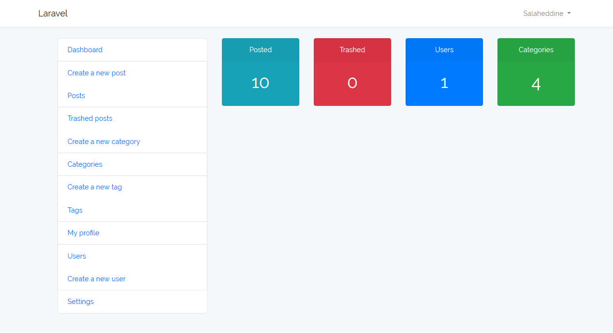
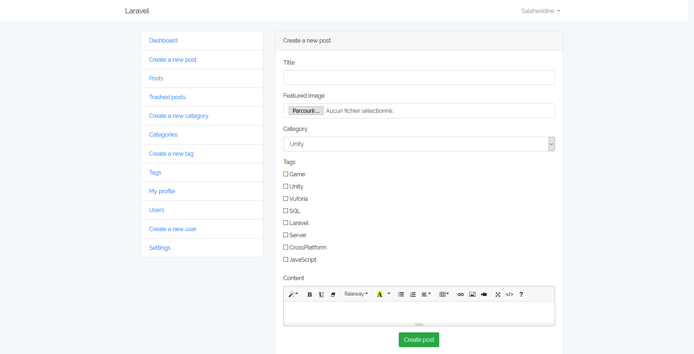
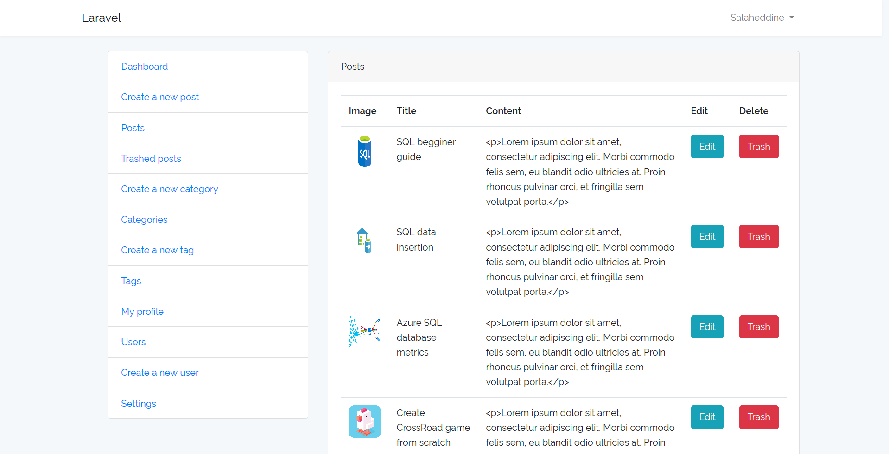
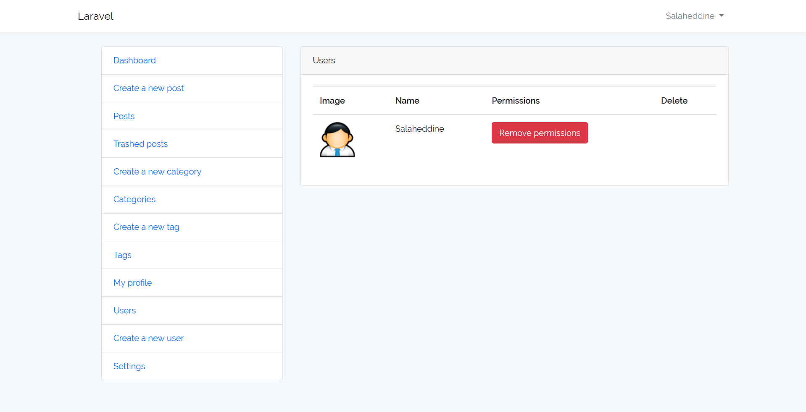
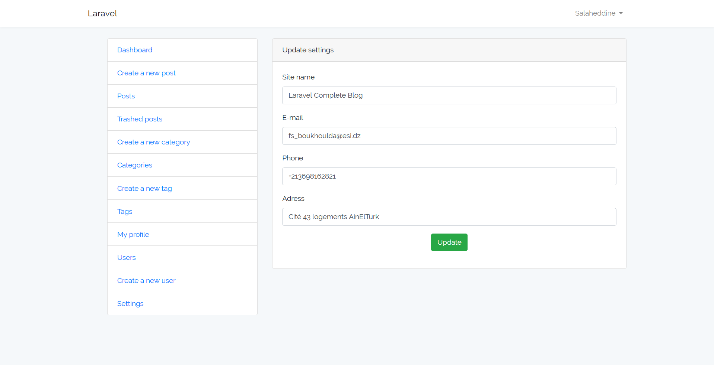
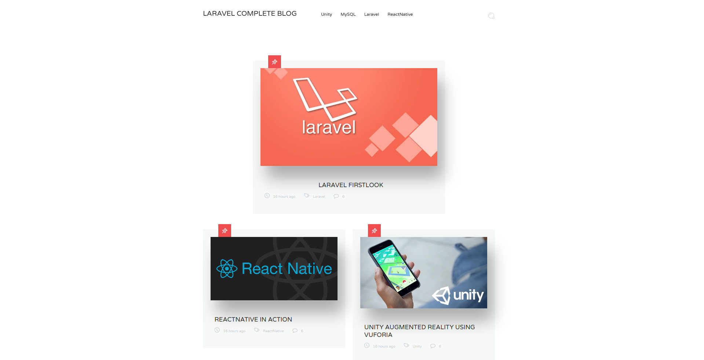
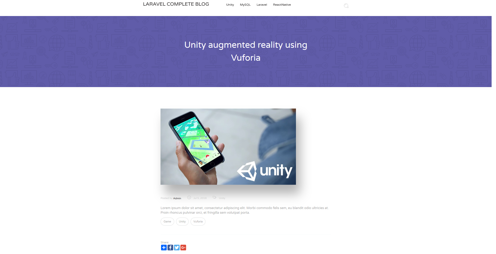
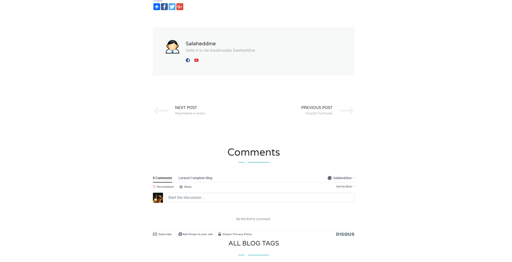
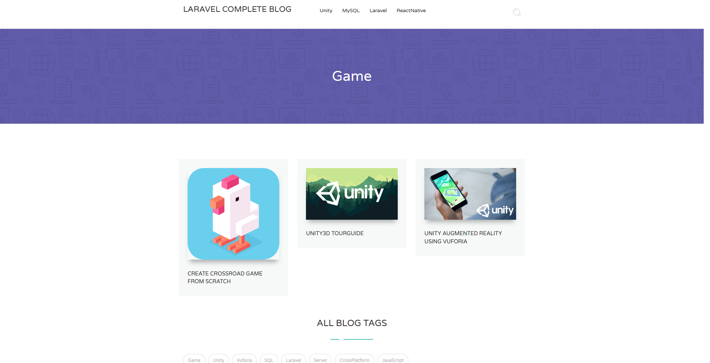
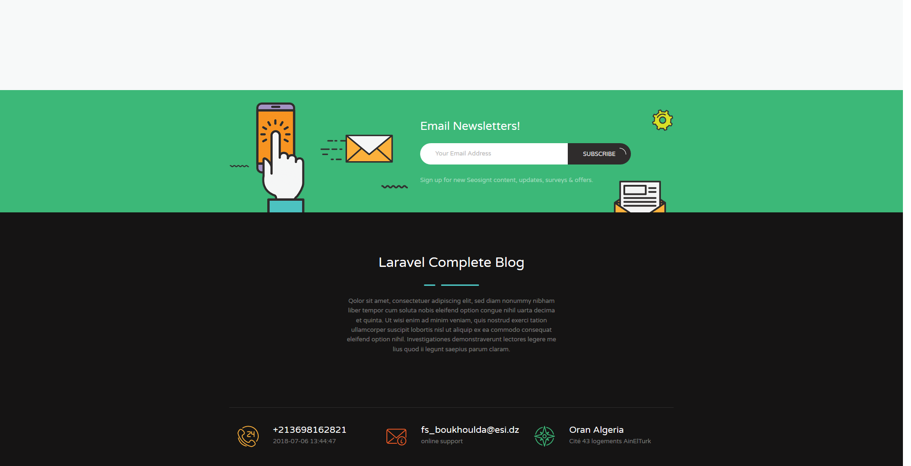

# LaravelCompleteBlog

A complete-fully functioning blog website, hardcoded from scratch, having both a user friendly blog front-end, and an easy-to-use CMS (also created in this project), having all features, such as CRUD for posts,categories,tags and having more such as comments, chats, mail subscription, user management and admins.

## Getting Started

just access the following link and join our family ;)
(https://linktowebsite.com/signup)

## How to use

### Using the CMS
Use our CMS to add posts,categories,tags, you can edit your profile add your avatar, using the simple dashboard provided.
Note that if you're an admin you've full control of CMS and accessing advanced features such as editing users, deleting em, and configure site settings.
here are some examples:
#### Dashboard

  

#### Some User/Admin features

    
    

#### Some only Admin features

    
    

### Exploring the blog
I'll leave you with this quick tour guide:

  

#### Blog single view

    
    

#### Category/Tag view

  

#### Emailsubscribtion

  

## Built With

* [Php](https://http://php.net/) - Server side language
* [Laravel](https://laravel.com/) - Php framework
* [Composer](https://getcomposer.org/) - Dependency Management
* [VisualCode](https://code.visualstudio.com/) - Text editor
* [VisualCode](https://www.apachefriends.org/fr/index.html) - Web dev environment

## Authors

* **Boukhoulda Salaheddine** - [SalaheddineDz](https://github.com/SalaheddineDz)

## License

apache-2.0